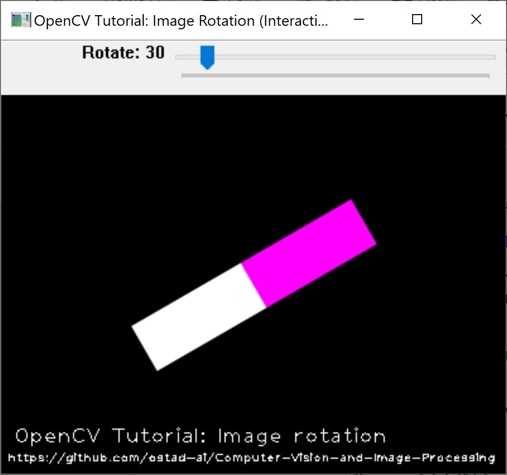
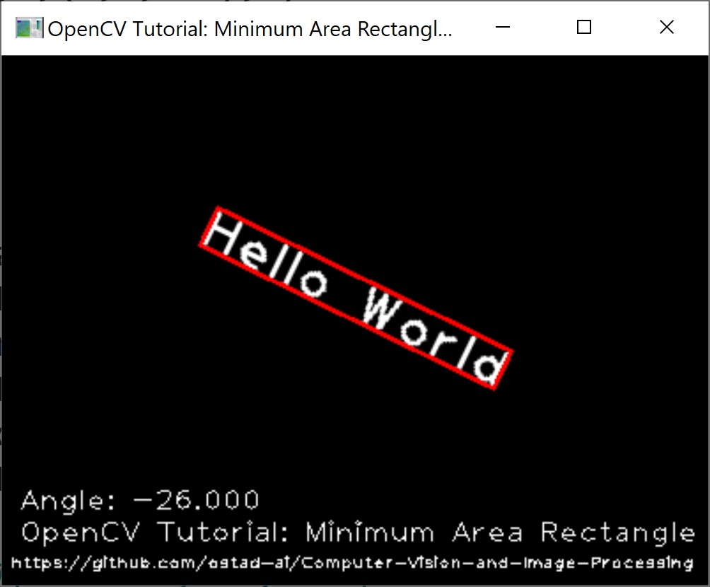

# Computer Vision and Image Processing
1. **OpenCV Tutorial, Image Rotation:** Here, a blank image is created. Then, it is filled by two rectangles using *rectangle* function. Next, the image is interactively rotated by changing the angle of rotation with a trackBar created by *createTrackbar*. Functions *getRotationMatrix2D* and *warpAffine* are used to implement the rotation around the center of the image.
 *Figure 1: A snapshot of image rotation by angle 30.*
---
2. **OpenCV Tutorial, Minimum Area Rectangle:** Using function *cv2.minAreaRect*, we find the boundign rectangle with minimum area for a set of poits. Here, points of a text are used. By pressing any key, the text image is randomly rotated. Then, we draw the computed minimum area rectangle over the image.
 *Figure 2: A snapshot of the rotated text image and its bounding rectangle.*
---